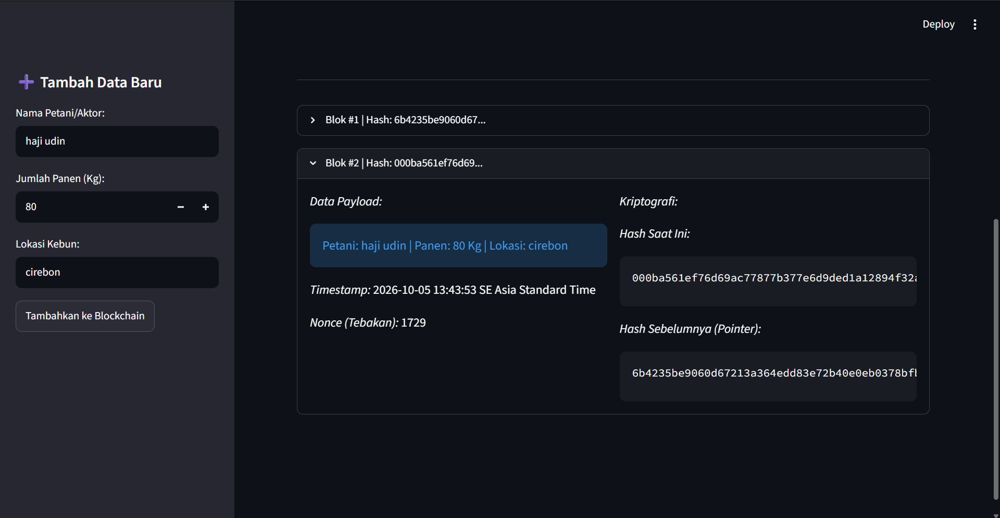

# 🔗 Blockchain for Halal Coffee Supply Chain

Proyek ini merupakan implementasi sederhana **Blockchain** untuk mencatat data rantai pasok kopi secara terstruktur dan aman. Pada proyek ini diterapkan konsep **Proof of Work (PoW)** sebagai mekanisme konsensus untuk proses mining setiap blok baru.

## 📌 Tujuan

Proyek ini dibuat untuk memahami cara kerja dasar blockchain, khususnya:

* Penyimpanan data dalam bentuk blok.
* Hubungan antarblok menggunakan **Previous Hash**.
* Penggunaan **Hash SHA-256** untuk menjaga integritas data.
* Penerapan **Proof of Work (PoW)**.
* Penggunaan **Nonce** dalam proses mining.
* Validasi untuk mengetahui apakah blockchain telah dimanipulasi.

## ⚙️ Fitur

### 1. Pencatatan Data Rantai Pasok Kopi

Pengguna dapat memasukkan:

* Nama petani/aktor
* Jumlah panen kopi
* Lokasi kebun

Data tersebut kemudian disimpan sebagai blok baru dalam blockchain.

### 2. Proof of Work

Sebelum blok ditambahkan ke blockchain, sistem melakukan proses **mining** dengan mencari nilai Nonce hingga menghasilkan hash yang memenuhi tingkat kesulitan tertentu.

Pada proyek ini digunakan:

```python
difficulty = 3
```

Artinya, hash yang dihasilkan harus diawali dengan **3 angka nol (`000`)**.

### 3. Nonce

**Nonce** adalah angka yang terus berubah selama proses mining. Sistem mencoba berbagai nilai Nonce sampai menemukan hash yang sesuai dengan tingkat kesulitan.

### 4. Hash

Setiap blok memiliki hash yang dibuat menggunakan **SHA-256**. Hash digunakan sebagai identitas blok sekaligus membantu menjaga integritas data.

### 5. Previous Hash

Setiap blok menyimpan hash dari blok sebelumnya melalui atribut `prev_hash`. Hal ini membuat setiap blok saling terhubung membentuk sebuah rantai.

### 6. Validasi Blockchain

Sistem dapat memeriksa apakah:

* Hash blok masih sesuai dengan datanya.
* `prev_hash` masih menunjuk ke hash blok sebelumnya.

Jika data diubah, validasi akan mendeteksi bahwa rantai sudah tidak valid.

## 🗂️ Struktur File

```text
mandiriptmn4/
│
├── app.py
├── core.py
└── README.md
```

### `core.py`

Berisi logika utama blockchain, seperti:

* `Block`
* `Blockchain`
* Perhitungan hash
* Mining dengan Proof of Work
* Nonce
* Validasi blockchain

### `app.py`

Berisi tampilan aplikasi menggunakan **Streamlit**, seperti:

* Form input data kopi
* Tampilan blockchain ledger
* Informasi hash dan previous hash
* Nilai Nonce
* Tombol pengecekan integritas blockchain

## 🚀 Cara Menjalankan

Pastikan Python dan Streamlit sudah terpasang.

Jalankan perintah berikut pada terminal:

```bash
streamlit run app.py
```

Kemudian buka alamat yang diberikan oleh Streamlit pada browser.

## 🔄 Alur Kerja

```text
Input Data Kopi
       ↓
Membuat Block
       ↓
Menentukan Nonce
       ↓
Proof of Work / Mining
       ↓
Hash memenuhi "000"
       ↓
Block ditambahkan ke Blockchain
       ↓
Blockchain dapat divalidasi
```

## 📖 Istilah Penting

| Istilah           | Penjelasan                                                                      |
| ----------------- | ------------------------------------------------------------------------------- |
| **Blockchain**    | Rangkaian blok yang saling terhubung menggunakan hash.                          |
| **Block**         | Tempat penyimpanan data dalam blockchain.                                       |
| **Hash**          | Nilai unik hasil proses kriptografi dari data blok.                             |
| **SHA-256**       | Algoritma yang digunakan untuk menghasilkan hash.                               |
| **Nonce**         | Angka yang diubah-ubah saat proses mining.                                      |
| **Mining**        | Proses mencari Nonce yang menghasilkan hash sesuai target.                      |
| **Proof of Work** | Mekanisme yang mengharuskan sistem melakukan perhitungan sebelum blok diterima. |
| **Difficulty**    | Tingkat kesulitan dalam mencari hash yang sesuai.                               |
| **Previous Hash** | Hash dari blok sebelumnya yang menjadi penghubung antarblok.                    |
| **Ledger**        | Tampilan catatan seluruh blok yang terdapat dalam blockchain. 

## ✅ Screenshoot      



## ✅ Kesimpulan

Proyek ini menunjukkan penerapan dasar **Blockchain dan Proof of Work** pada kasus rantai pasok kopi. Dengan adanya hash, previous hash, nonce, dan proses mining, setiap blok menjadi saling terhubung dan perubahan data dapat terdeteksi melalui proses validasi blockchain.

